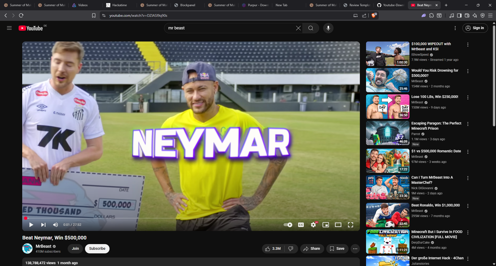
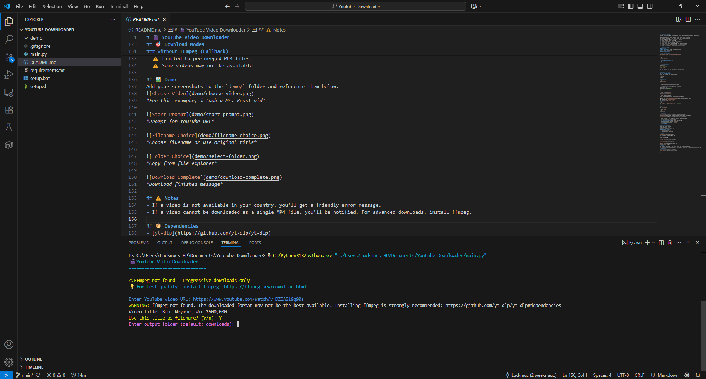
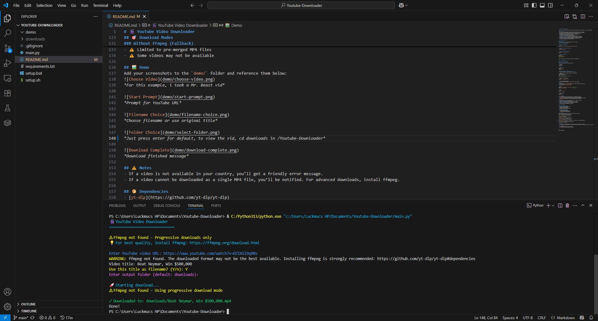

# 🎬 YouTube Video Downloader

A powerful, user-friendly Python script to download YouTube videos in high quality with full ffmpeg support!

## ## ⚠️ Notes
- The script automatically detects ffmpeg and adjusts download options accordingly
- If a video is not available in your country, you'll get a friendly error message
- Without ffmpeg: Only progressive MP4 files can be downloaded
- With ffmpeg: All formats supported with automatic conversion to MP4res
- 🔗 Download any public YouTube video by URL
- 📝 Choose your own filename or use the original video title
- 📁 Select or create your preferred output folder
- 🎯 **FFmpeg integration** for high-quality downloads and format conversion
- 📊 Multiple quality options (Best, 720p, 480p) when ffmpeg is available
- 🔄 Automatic fallback to progressive downloads if ffmpeg is not installed
- 🌍 Friendly error messages for region-locked or unavailable videos
- 🎨 Colorful, interactive command-line interface

## 🚀 Quick Start Tutorial

### Prerequisites
- **Python 3.6 or higher** must be installed on your system
- Git (for cloning the repository)

### Step-by-step Installation

1. **Clone the repository:**
```bash
git clone https://github.com/Luckmuc/Youtube-Downloader.git
```

2. **Navigate to the project directory:**
```bash
cd Youtube-Downloader
```

3. **Install Python dependencies:**
```bash
pip install -r requirements.txt
```

4. **Run the downloader:**
```bash
python main.py
# or on some systems:
python3 main.py
```

That's it! The script will guide you through the download process.

## 🚀 Getting Started

### Alternative Setup Methods

#### Quick Setup (Recommended)
Run the setup script for your operating system:

**Windows:**
```powershell
setup.bat
```

**Linux/macOS:**
```bash
chmod +x setup.sh
./setup.sh
```

#### Manual Setup with Virtual Environment
1. Clone or download this repository to your computer

2. Create a virtual environment (optional but recommended):
```powershell
python -m venv .venv
.venv\Scripts\activate  # Windows
# or
source .venv/bin/activate  # Linux/macOS
```

3. Install Python dependencies:
```bash
pip install -r requirements.txt
```

4. Install FFmpeg (Recommended)
For the best quality downloads and format support, install FFmpeg:

**Windows:**
- Download from [https://ffmpeg.org/download.html](https://ffmpeg.org/download.html)
- Or use chocolatey: `choco install ffmpeg`
- Or use winget: `winget install FFmpeg`

**Linux:**
```bash
sudo apt update && sudo apt install ffmpeg  # Ubuntu/Debian
sudo dnf install ffmpeg                     # Fedora
```

**macOS:**
```bash
brew install ffmpeg
```

5. Run the Script
```bash
python main.py
```

## 📦 Dependencies
- [yt-dlp](https://github.com/yt-dlp/yt-dlp) - YouTube video downloader
- [colorama](https://pypi.org/project/colorama/) - Colored terminal output
- [ffmpeg-python](https://github.com/kkroening/ffmpeg-python) - FFmpeg Python bindings
- [FFmpeg](https://ffmpeg.org/) - Media processing (external dependency)

## 🛠️ Usage
1. Run the script and it will automatically detect if ffmpeg is available
2. Enter the YouTube video URL when prompted
3. Choose to use the original title or enter a custom filename
4. **If ffmpeg is available:** Select quality (Best/720p/480p)
5. Select an output folder (default: `downloads`)
6. The video will be downloaded as an MP4 file

## 🎯 Download Modes

### With FFmpeg (Recommended)
- ✅ Highest quality downloads possible
- ✅ All video formats supported
- ✅ Quality selection options
- ✅ Automatic format conversion to MP4

### Without FFmpeg (Fallback)
- ⚠️ Progressive downloads only
- ⚠️ Limited to pre-merged MP4 files
- ⚠️ Some videos may not be available

## 🖼️ Demo
Add your screenshots to the `demo/` folder and reference them below:

*For this example, i took a Mr. Beast vid*


*Prompt for YouTube URL and enter your Youtube-URL*


*Choose filename or use original title*


*Just press enter for default, to view the vid, cd downloads in /Youtube-Downloader*


*Download finished message*

## ⚠️ Notes
- If a video is not available in your country, you’ll get a friendly error message.
- If a video cannot be downloaded as a single MP4 file, you’ll be notified. For advanced downloads, install ffmpeg.

## 📦 Dependencies
- [yt-dlp](https://github.com/yt-dlp/yt-dlp)
- [colorama](https://pypi.org/project/colorama/)


---

Enjoy downloading! 🚀
